# GreenStory

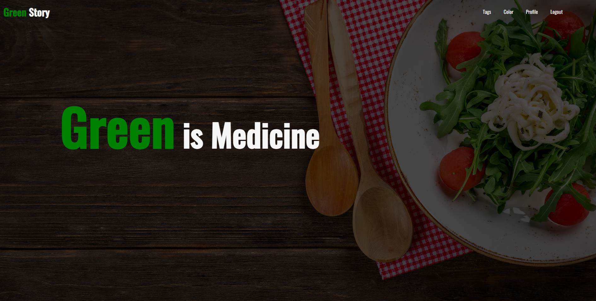

<br>
This is a Healthy Recipe Community Platform which I made as a personal project using React 18, Node.js, MySQL and Sass.

I developed this website based on my experience living alone. Whenever I cooked my own meals, I always wondered what the were the particular health benefits of the food that I ate. For instance, if I ate broccolli, I was curious how this food will benefit my body and the types of recipes that could be made using this particular type of food. Furthermore, I thought it would be great if I could easily share my own recipes with others.


<br>
<br>

##Table of Contents
* Features
* Dependencies
* License

## Features

### Sign Up

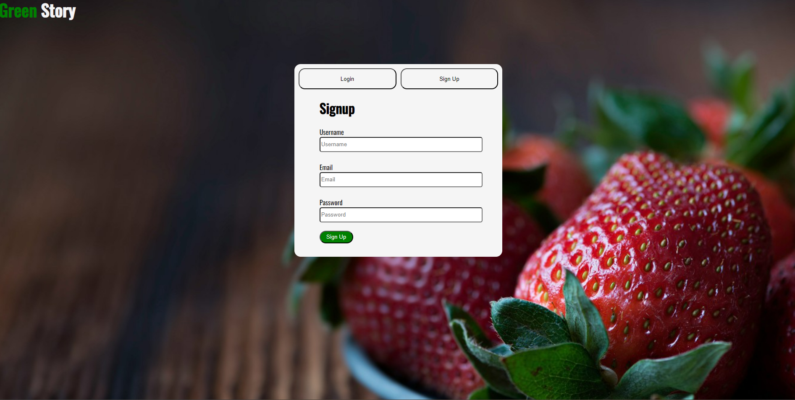

If the user hasn’t already signed up then they can click on the sign-up button on the upper right box and fill in their information. 

-	The email must be of the correct format and will show errors if they are in an invalid format
-	Boxes will be outlined in red if there are any empty boxes, if the email format is incorrect, or if the passwords do not match each other. 
-	If all cases are acceptable, then the user can create their account.


### Login 

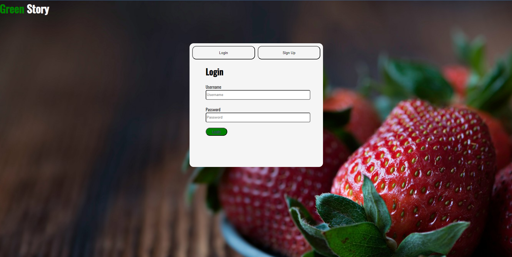

-	The user will type in his username, email, and password to create an account.
-	Check id duplicate: The duplicate button checks whether the id is already in the database. But the same id and different user types can be allowed to register on this web page. 
-	Check password and confirm password: We will check the password and confirm that password is the same. 
-	Check no blank form when register clicked: If the user doesn’t fill all forms and click the Register button, it will issue a failed alert. So, the user should fill out all forms. 
-	Create an account: If the user succeeded in creating their account, they can log in and enjoy our website. 
-	Move to the login page: If the user clicks the “Login” button, the login box will show up.


### Home Page


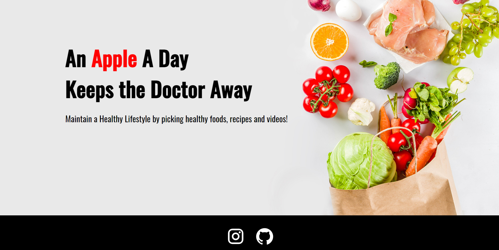

This is the home page of our website. It consists of two images that can be seen when the user scrolls down. The text displays the site’s motives and ideals: A healthy diet. We can move to other pages when we click on the navigation bar at the top. The navigation bar consists of 5 buttons: home page, tag, color, profile, and logout. The ‘Green Story’ homepage button brings us back to the current page. The tag button will take us to the page that lists the food by its tags (benefits that the food may bring). The color button will take us to the page that lists the food by color (e.g broccoli – green, carrot – orange). The logout button will log the user out and bring them back to the previous login page. 


###  Tags Page

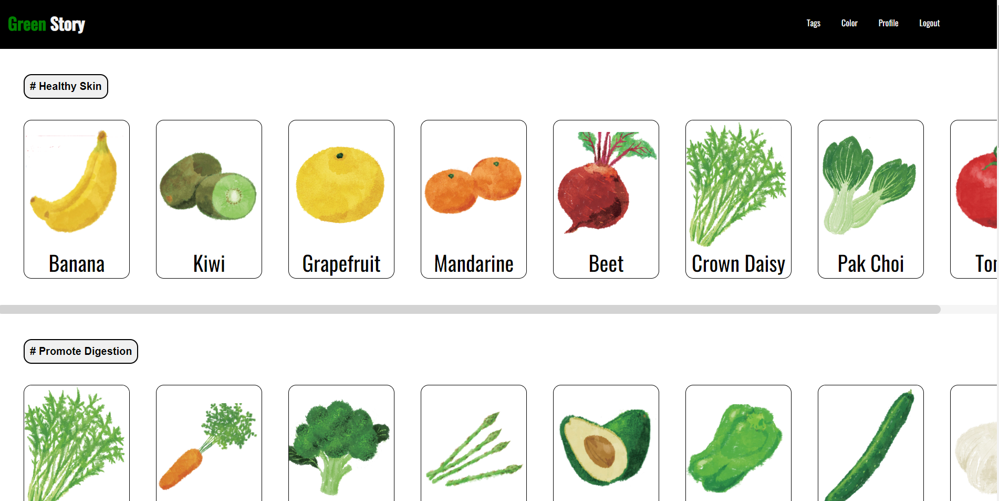

-	Identify foods based on their benefits: The user can identify foods that are for his supposed purpose. For instance, let’s say that the user wants to know about foods that can make his skin healthier. The user can conveniently see all of the available foods that are known for that purpose. 
-	Scroll through the foods: The user can also use the scroll bar to look through the foods in case there were too many foods to display on the screen. 
<br>
1)	Click on Card:
When we click on the card it will take us to the detail page which will show the user more helpful information about the product.

### Color Page

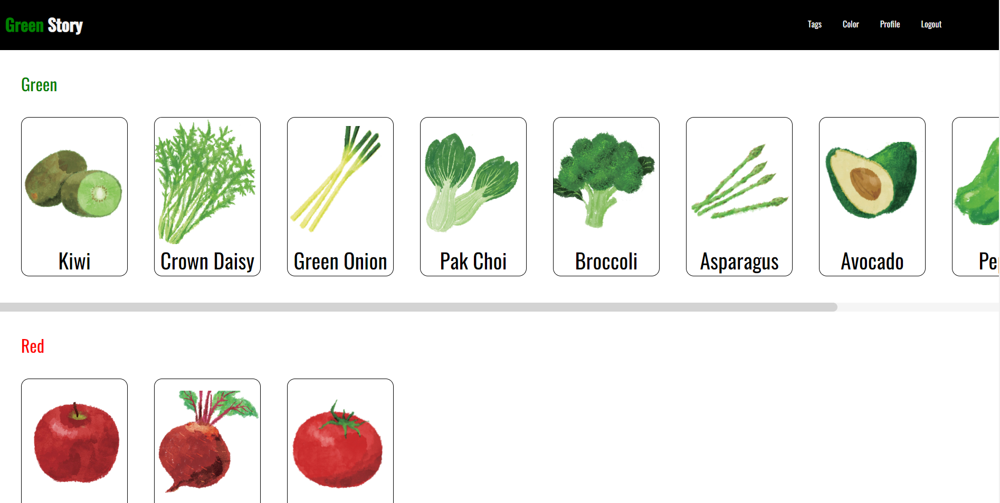

Unlike the tag page, this page organizes the products by their color which provides the user with an intuitive method to search for a product. Green, red, white, and orange are the colors provided. 
2)	Click on Card:
When we click on the card it will take us to the detail page which will show the user more helpful information about the product.


### Product Detail Page

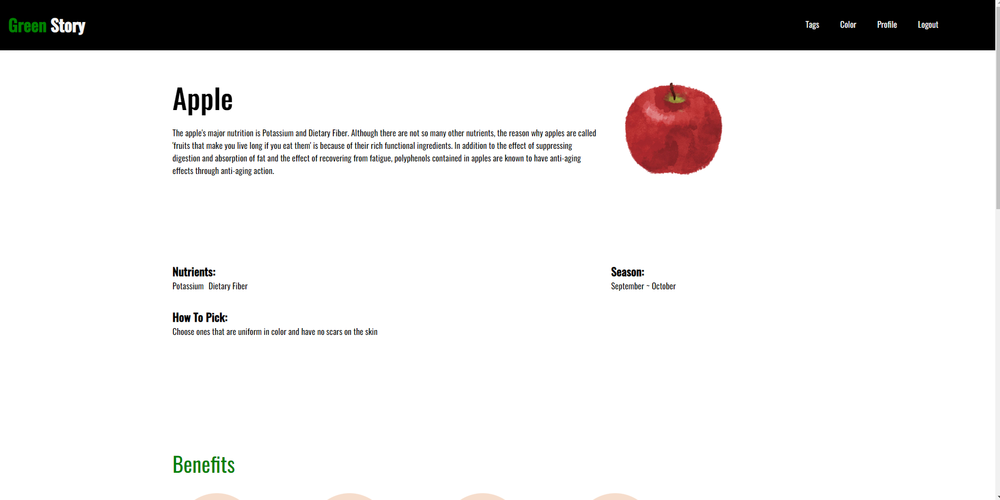
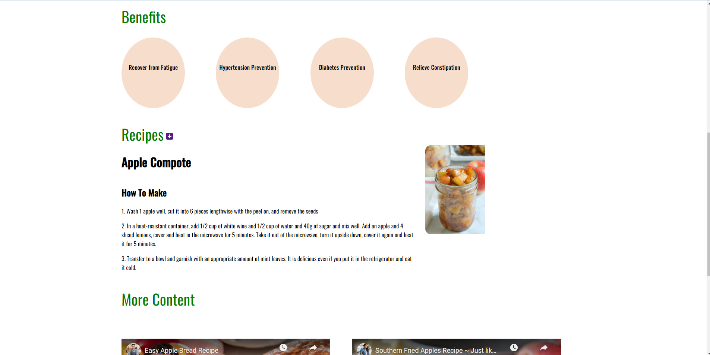
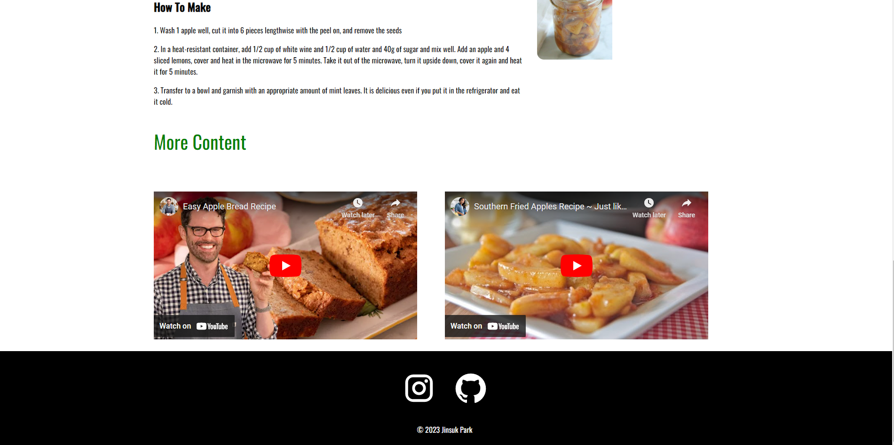

This is the product detail page. This page shows the page product information about each card

1)	Product explanation
This space shows an overall description of the product.
2)	Nutrient
This space shows the major nutrients of the product.
3)	Season
This space shows the best season of the product.
4)	How to pick
Users can use this information on how to pick a good product 
5)	Benefits
This space represents the benefits of the product. So, the user can choose a product that has the desired effect
6)	Recommended Recipe
Web site show recommended recipe for the product. Recipes are selected, so users can easily cook and eat them. 
7)	More content
This feature allows users to view other people's recipes, giving them many options for recipes.


### More Recipe Page

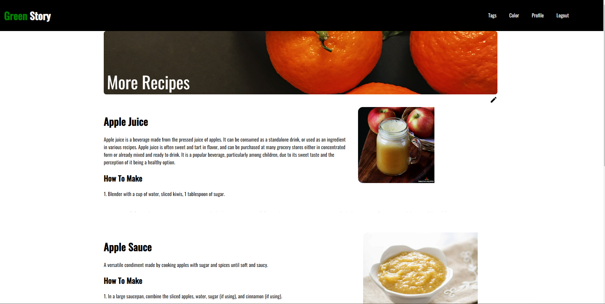
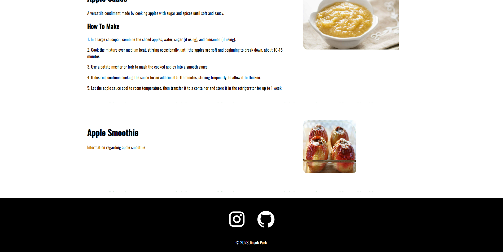

This page shows user recipes for the product or provides a function for users to add their own recipes.
1)	function switching button
When the user clicks this button, it switches to a screen showing user recipes or a screen to add recipes.
2)	my recipe section
This screen shows other users' recipes for the product.
3)	Section for adding user recipes
The user may write the recipe name and recipe description in the recipe name box and the content box, respectively.
After writing, when the finish button is clicked, the user recipe is sent to the server, and the server adds the user recipe data in user data and product data, respectively.


### Profile Page

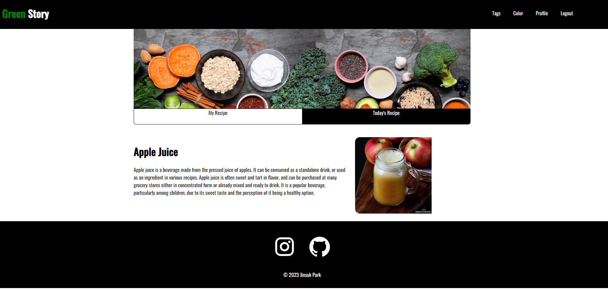

This page shows recipes that logged-in users created
1)	Today’s recipe
If the user visits this page first, the user can see a recipe that we recommend to the user
2)	User Recipe
This section shows all user recipes created by the logged in user.


## Dependencies
```javascripty
"@emotion/react": "^11.10.5",
    "@emotion/styled": "^11.10.5",
    "@mui/icons-material": "^5.11.0",
    "@mui/material": "^5.11.7",
    "@testing-library/jest-dom": "^5.16.5",
    "@testing-library/react": "^13.4.0",
    "@testing-library/user-event": "^13.5.0",
    "axios": "^1.3.2",
    "json-loader": "^0.5.7",
    "react": "^18.2.0",
    "react-awesome-reveal": "^4.2.3",
    "react-dom": "^18.2.0",
    "react-quill": "^2.0.0",
    "react-router-dom": "^6.8.0",
    "react-scripts": "5.0.1",
    "sass": "^1.57.1",
    "tachyons": "^4.12.0",
    "web-vitals": "^2.1.4"
```
[image](public/img/)


## [License]
Greenstory follow MIT lICESNSE and is freely available for free and may be redistributed under unlimited conditions


